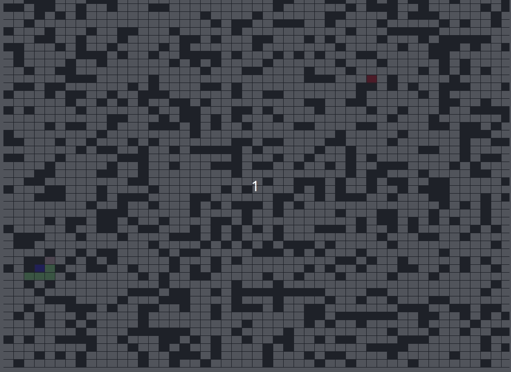
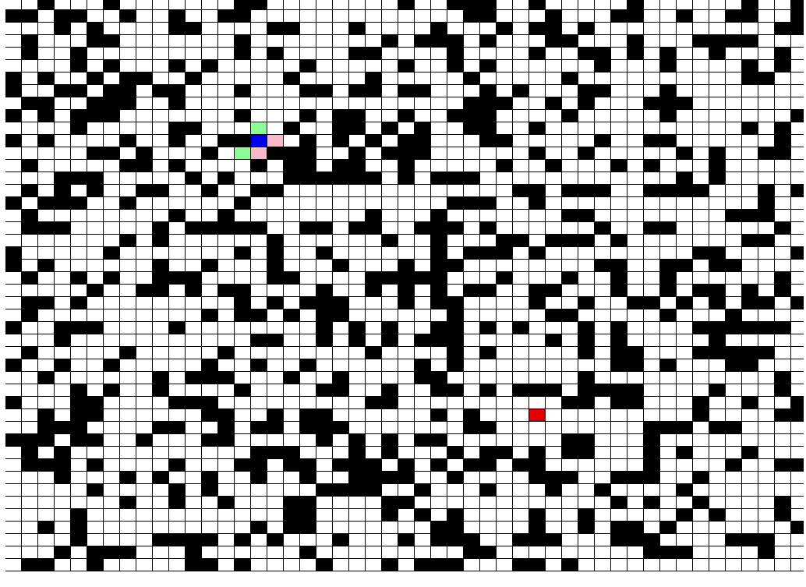
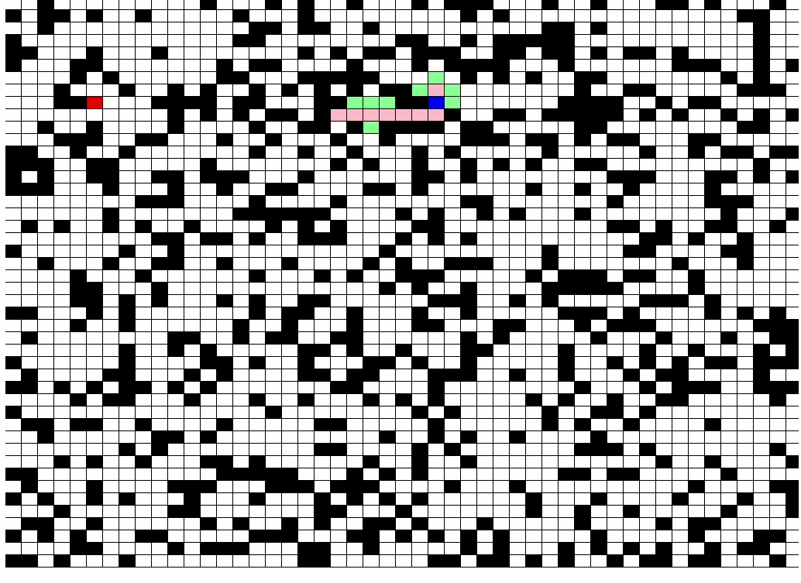
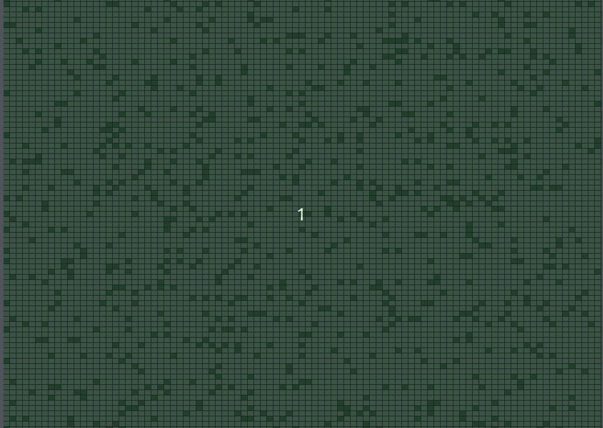
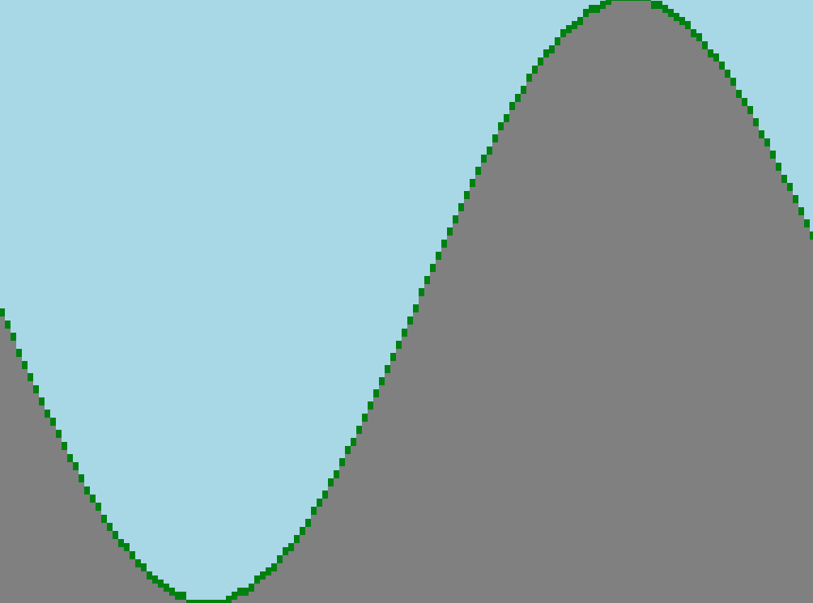

# bdv-engine

A more serious attempt in making a Game Engine and image processing tool using the Canvas API to WebGL.
I know there are tons of great frameworks out there, my actual purpose is the learning process and fun.

> typescript javascript canvas webgl

**Build status**

[](https://travis-ci.org/badges/badgerbadgerbadger)


***Graphics***







## Table of Contents

- [Installation](#installation)
- [Features](#features)
- [License](#license)


## Installation

### Clone

- Clone this repository to your local machine using the following link `https://github.com/Brunodev09/bdv-engine`

### Setup and Execution

  There isn't a practical installation process yet. For now you can clone it, run `npm run start` and just like in my Main.js file, import the engine
  doing the following:
  
  ```
  const bdv = require("./dist/src/core/bdv").default;
  ```
  
  If you're using Typescript, there is a default export, so you could:
  ```
  import bdv from "./src/core/bdv";
  ```


  The whole concept of this tool is to abstract away the boring process of encapsulation needed on the Canvas API to actually create
  something reusable. That includes, animation loops, shapes constructions, positions and dimension managament and rendering.
  So I use what I call a "GameObject" to do just that, so all we have to worry about is the logic of what we want to build.
  
  Practical example:
  
  Create or edit the Main.js file:

```
let bdv = require("./dist/src/core/bdv").default;

window.onload = function () {
    let engine = new bdv(1024, 768);
    engine.activateCanvasRendering();
}

```

  This is all it takes to load the animation/game loop. This library will already create and attach a Canvas element with context to the HTML file.
  Using the command:
```
npm run start
```

  Will compile the Typescript, Browserify the exports and automatically open a chrome service with the target HTML. (In this case test.html)
  > You can remove the chrome service if you like, in the `package.json` file. Specifically in `start` property.
  The running of the `npm run start` will give you an empty black screen.
  
  From then you can either create your own GameObjects or load a renderable template.
  
  Creating your own GameObjects:
  
  ```
let mySquare = engine.newGameObject("RECTANGLE", 500, 200, 100, 100, "blue");
let myPath = engine.newGameObjectArray("POINTS", [[100, 20], [25, 100], [11,10]], "green");
  ``` 
  
  Executing templates:
  ```
engine.grid(10, 10);
   ```
   
  ```
engine.aStar(50, 50, null, null, null, null, 50, null);
   ``` 

  ```
engine.aStar(50, 50, null, null, null, null, 50, null);
   ```   
   
  ```
engine.conways(100, 100, "green", "lightgreen", 100);
   ```   
   
  Keep in mind that at every change you must use the "npm run start" command to recompile the files and re-render. (Sorry I'm going to change this ASAP)
  
  
  Basic methods for now:
  
  ```
   newGameObjectArray = (model: string, positions: number[][], color: string, font?: string, message?: string): GameObject
   newGameObject = (model: string, positionX: number, positionY: number, width: number, height: number, color: string, font?: string, message?: string): GameObject
   conways(xRow: number, yRow: number, aliveColor?: string, deadColor?: string, speed?: number, seed?: any[][]): Conways
   async aStar(xRow: number, yRow: number, xStart?: number, yStart?: number, xEnd?: number, yEnd?: number, speed?: number, allowDiagonal?: boolean, seed?: number[][]) 
  ``` 
  
  > A* class is asynchronous for purely aesthetical reasons. So that I could use a promisified timeout to control the speed of the animations.
   
  
---


## Features

> Practical abstractions to create with WebGL using the Canvas API.
> Pixel (imageData) and shape rendering.
> Game-Objects.
> Renderizable templates.
> Trackable and fully customizable grid system.
> A* algorithm visualization.
> Conways game of life algorithm visualization.


## Coming soon
> Collidables.
> Read image files RGB and port it to a interpretable JSON to load a tiled map.
> Dungeon generation algorithm.
> Perlin Noise and mandelbrots.
> Easy networking for multiplayer based applications.


## Tests
- Tests are going to be written using Mocha and JEST.

## Documentation
Still trying to find the time to document the code accordingly. When I do, I'll use JSDoc.


## License

[](http://badges.mit-license.org)

- **[MIT license](http://opensource.org/licenses/mit-license.php)**
